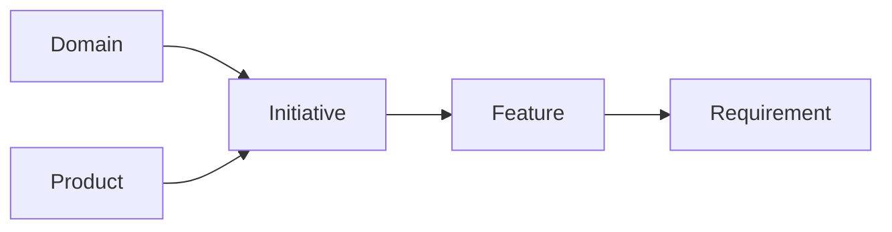
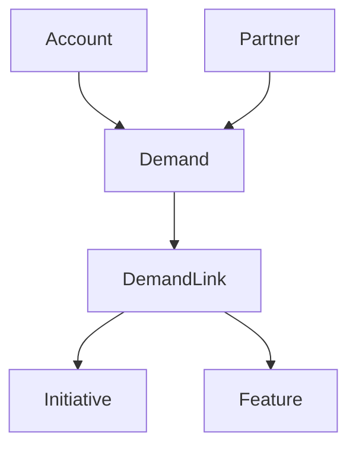

# Tymio hub ontology — small graph for agents

Use this **before** listing or mutating hub data so you pick the right entity layer and MCP tools. There are **two** “ontology” ideas in Tymio; both matter.

---

## 1. Backlog ontology (work graph)

**What it is:** The **tenant’s work model** — domains, products, roadmap bets, delivery breakdown, and signals. These are **rows** in the hub (`drd_*` list/get/create/update tools).

**Core spine (always walk in this direction when drilling down):**

| Entity | Role | Typical parent / anchor |
|--------|------|-------------------------|
| **Domain** | Strategic bucket / swimlane | Tenant taxonomy (`drd_list_domains`) |
| **Product** | Product line or surface (optional on initiative) | Tenant taxonomy; `productId` nullable on **Initiative** |
| **Initiative** | Roadmap bet / epic | **Required** `domainId`; optional `productId` |
| **Feature** | Sized deliverable under one initiative | **Required** `initiativeId` |
| **Requirement** | Finest execution row; what devs implement | **Required** `featureId`; may map to execution board column |

**Signals and context (link into the spine):**

| Entity | Role |
|--------|------|
| **Demand** | Incoming idea / request; **DemandLink** attaches to an **Initiative** and/or **Feature** |
| **Account** / **Partner** | B2B context; **Demand** may reference them |

**Hung off Initiative (portfolio / PO view):**

- **Decision**, **Risk** — commitments and threats  
- **Stakeholder**, **InitiativeAssignment** — people and ownership  
- **InitiativeMilestone**, **InitiativeKPI** — time and outcome framing  
- **InitiativePersonaImpact** / **Persona** — who benefits  
- **InitiativeRevenueStream** / **RevenueStream** — revenue mix  
- **SuccessCriterion** — checklist-style success under the initiative  
- **Dependency** — **initiative → initiative** only (`fromInitiativeId` / `toInitiativeId`); not feature-level edges in this model  

**People on delivery rows:**

- **Initiative.owner**, **Feature.owner**, **Requirement.assignee** — use assignments and owner fields when explaining “who”.

**Design / external IDs (for agents reading descriptions):**

- Initiative: deep links often in **`notes`**; Feature: **`description`** + **`acceptanceCriteria`** for behavior; Requirement: **`externalRef`** for primary ticket/node id — see `docs/DESIGN_REFERENCES.md`.

---

## 2. Capability ontology (product affordances)

**What it is:** A **semantic map of what the hub can do** — named capabilities bound to routes, pages, MCP tools, and models. It is **not** a backlog row. The word **“Capability”** here ≠ **Feature** entity.

**How agents use it:**

- **`tymio_get_agent_brief`** or `GET /api/ontology/brief` — compiled brief aligned with live bindings  
- **`tymio_list_capabilities`** / **`tymio_get_capability`** — inspect a single affordance  
- Optional checked-in snapshot: `context/AGENT_BRIEF.md` (regenerate from hub; not hand-edited as source of truth)

Use the **capability ontology** to answer “what screens/APIs exist?” Use the **backlog ontology** to answer “what work exists and how is it decomposed?”

---

## 3. How smarter tool use follows the graph

1. **Resolve taxonomy first:** `drd_meta` / `drd_list_domains` / `drd_list_products` so **Domain** and **Product** ids are real.  
2. **Narrow to one Initiative** before creating **Features** (every feature needs `initiativeId`).  
3. **Narrow to one Feature** before creating **Requirements** (every requirement needs `featureId`).  
4. **Dependencies between bets** are **Initiative ↔ Initiative**; do not invent cross-feature “dependency” rows if the hub only exposes initiative-level deps.  
5. **Demands** explain *why* something exists; follow **DemandLink** to the initiative/feature you should update.  
6. When the user asks about **“the ontology”** ambiguously, clarify: **work graph** (above) vs **capability brief** (`tymio_*`).

---

## 4. See also

- Base skill: [../SKILL.md](../SKILL.md)  
- MCP tool names and REST: [mcp-and-rest.md](mcp-and-rest.md)  
- Design fields by layer: [docs/DESIGN_REFERENCES.md](../../../../docs/DESIGN_REFERENCES.md)  
- Capability / admin semantics: [docs/CODING_AGENT_HANDOFF_TYMIO_APP.md](../../../../docs/CODING_AGENT_HANDOFF_TYMIO_APP.md) (ontology section)
