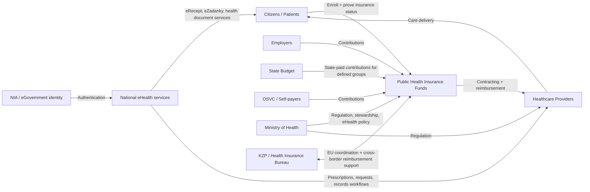

# Czech Health Insurance System (Czechia) - Research & System Map

**Prepared:** 2026-03-03  
**Scope:** Public health insurance in Czechia, funding/eligibility/access logic, and digital integration context for Doctor Digital.

---

## 1) Quick Summary

- Czechia operates a **mandatory public health insurance** system (statutory/social model) with **universal compulsory participation** for eligible residents/workers.
- The system is regulated mainly by **Act No. 48/1997 Coll.** and coordinated with EU social security rules where applicable.
- Funding is contribution-based (total baseline **13.5%** assessment), with the **state paying contributions for defined groups** (children, pensioners, selected caregivers, etc.).
- The Ministry of Health is the central steward/regulator; **7 public health insurance funds** contract care providers.
- **Private/commercial insurers** (e.g., UNIQA, Direct and others) are a separate layer: they do not replace the statutory system for people already in public insurance, but can provide commercial or supplementary coverage depending on user category and product.
- Czech digital health stack now includes national services such as **eRecept** and **NPEZ** (with **eZadanky** and other services), and citizen access is tied to **NIA/eGovernment identity methods**.

---

## 2) System Map (Actors and Flows)

---

## 3) How the System Works in Practice

### 3.1 Coverage and participation

- Participation in public health insurance is mandatory for people with permanent residence and for employees of Czech employers; selected non-resident categories are also included under law/EU rules.
- Insured persons choose one public insurance fund and can switch under defined rules.
- Proof of insurance (card/certificate) is required when receiving care.

### 3.2 Financing logic

- Public health insurance contributions are calculated from an assessment base; commonly referenced total rate is **13.5%**.
- Payment source depends on person category:
  - employee/employer split via payroll,
  - self-employed / self-payer direct payments,
  - state-paid contributions for eligible categories.
- Czech system financing is predominantly public, with private spending and OOP costs as a minority share.

### 3.3 Purchasing and service delivery

- Insurance funds purchase/contract services from provider networks.
- Patients keep broad provider choice (subject to contracted networks and clinical pathways).
- Benefit package is broad; some co-payments/out-of-pocket areas remain (notably selected pharmaceuticals/dental/above-standard services).

### 3.4 EU / cross-border layer

- EU social security coordination rules apply where relevant (including EHIC logic for necessary care during temporary stays).
- KZP acts as liaison/contact body for cross-border reimbursement and coordination tasks.

### 3.5 Private/commercial insurance (UNIQA, Direct, etc.)

- In Czechia, the core system is **public/statutory insurance** via the 7 health insurance funds; this is the default financing base for covered care.
- **Commercial/private insurers** (for example UNIQA, Direct, PVZP, Slavia and others, depending on product portfolio) typically sit in a different layer:
  - supplementary products (accident, daily allowance, selected add-ons),
  - travel/expat products,
  - commercial medical insurance for foreigners who are not in the public scheme.
- For third-country nationals not participating in public insurance, official Czech guidance points to commercial insurance as one of the valid coverage routes.
- Product scope, exclusions, limits, and claim rules are insurer-specific and must be checked per policy; do not assume parity with statutory entitlements.
- For Doctor Digital roadmap design: treat private insurance integration as **payer-contracting and product integration work**, separate from public eHealth interfaces (eRecept/eZadanky/NIA).

---

## 4) Digital Health and eGovernment Layer (Important for Product)

### 4.1 eRecept

- National ePrescription infrastructure (SUKL/government ecosystem) is a core digital service.
- Patient-facing access is available via web/mobile and integrated with NIA authentication methods.

### 4.2 NPEZ and eZadanky

- National eHealth portal (NPEZ) provides secure access to multiple services.
- Current public portal content includes **eZadanky** (electronic requests), eRecept linkage, and document-delivery related workflows.

### 4.3 Identity and authorization pattern

- **NIA/eGovernment login methods** (BankID and others) are used for access to public digital health services.
- For private apps, a common architecture is: external eGovernment identity for authentication + app-native authorization model (roles, scopes, consent, tenancy).

---

## 5) Implications for Doctor Digital Backlog

- **Interoperability is strategic:** eRecept + eZadanky + Czech eGovernment should be treated as a connected integration stream, not isolated features.
- **Authorization architecture decision is critical:** clarify current Doctor Digital auth system before selecting full eGovernment login strategy.
- **Compliance-by-design:** legal basis, auditability, and minimum-necessary data exchange must be built into integration scopes from day one.
- **Institutional/B2B readiness:** reporting, tenant separation, and role controls are key for employer/local-government client zone scenarios.

---

## 6) Recommended Next Research Actions

- Confirm the **exact production interfaces** and onboarding requirements for:
  - eRecept integrations,
  - eZadanky/NPEZ-related workflows,
  - accepted identity providers and trust levels for NIA-based login.
- Produce a **capability matrix**: what can be read, written, delegated, and audited per actor (patient, doctor, org admin, support).
- Align legal/compliance review with architecture decisions before implementation commitments.

---

## 7) Sources (Primary references used)

- Act No. 48/1997 Coll. (informational translation and source linkage):  
  https://www.zakonyprolidi.cz/translation/cs/1997-48?langid=1033
- KZP (Health Insurance Bureau) - Health insurance system in Czechia:  
  https://kancelarzp.cz/en/usefull-links-info/health-insurance-system-in-cz/
- European Observatory (WHO/Observatory) - Czechia health system review 2023:  
  https://eurohealthobservatory.who.int/publications/i/czechia-health-system-review-2023
- eRecept patient application (Czech public administration portal):  
  https://portal.gov.cz/en/sluzby-vs/aplikace-erecept-pro-pacienty-S11087
- National eHealth portal (NPEZ):  
  https://www.ezdravi.gov.cz/
- Czech integration portal for foreigners - health insurance overview (official guidance with public vs commercial paths):  
  https://www.cizinci.cz/web/en/health-and-health-insurance
- Czech Ministry of Health - health insurance funds (official list/context for public funds):  
  https://www.mzcr.cz/zdravotni-pojistovny-2/

> Note: Legal interpretation should be validated with Czech legal/compliance counsel before execution decisions.
