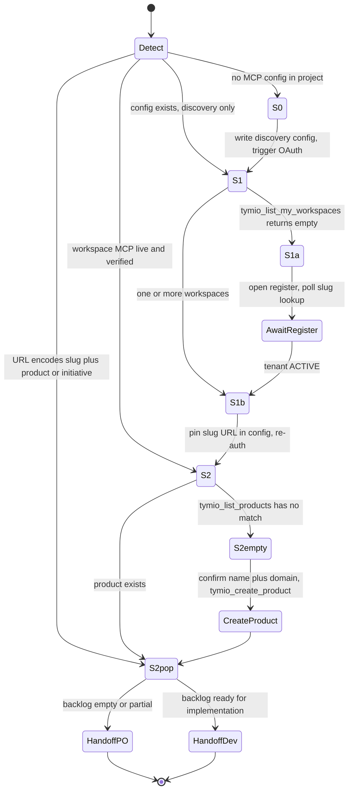
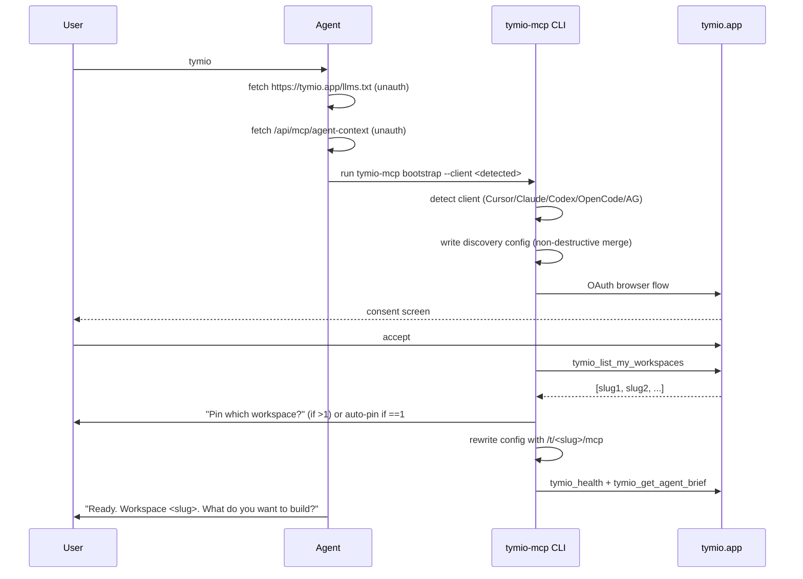
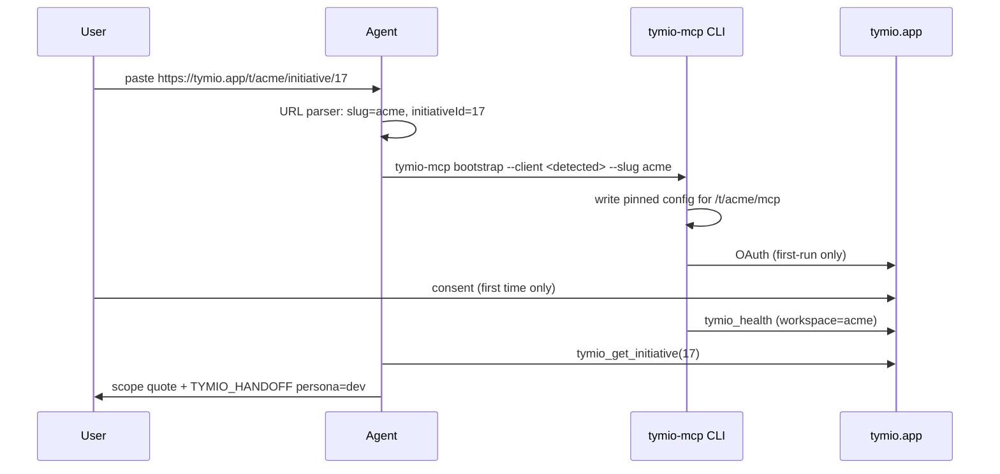
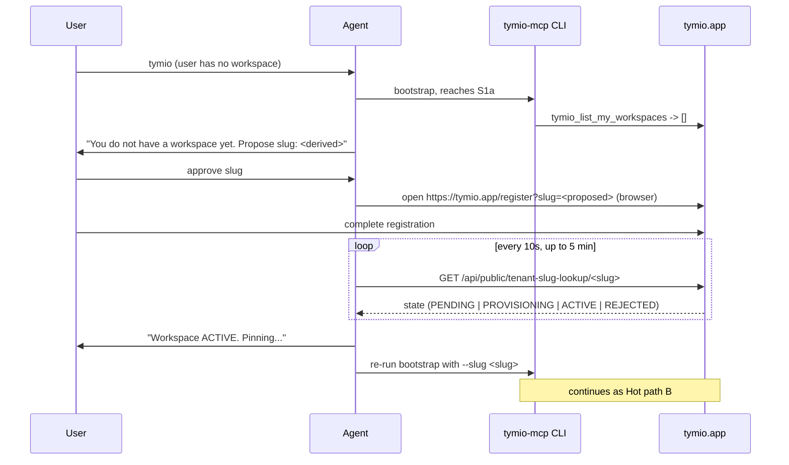
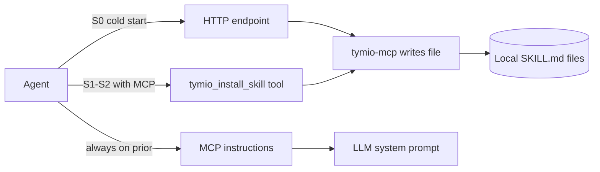

# Tymio agent onboarding — bootstrap specification

**Status:** accepted — implementation follows [TYMIO_MCP_RENAME.md](TYMIO_MCP_RENAME.md) first, then bootstrap PRs per [Dependencies and sequencing](#dependencies-and-sequencing). **Engineering vs hub:** track phases and hub product **CLI-NPM** in [TYMIO_IMPLEMENTATION_STATUS.md](TYMIO_IMPLEMENTATION_STATUS.md).
**Owner:** product / core MCP / CLI.
**Depends on:** [TYMIO_MCP_RENAME.md](TYMIO_MCP_RENAME.md) landing first. All tool names in this document use the canonical `tymio_*` namespace.
**Companion docs:** [.cursor/skills/tymio-workspace/](../.cursor/skills/tymio-workspace/), [mcp/TYMIO_MCP_CLI_AGENT_GUIDANCE.md](../mcp/TYMIO_MCP_CLI_AGENT_GUIDANCE.md), [docs/TYMIO_AGENT_ROLES_PM_PO_DEV.md](TYMIO_AGENT_ROLES_PM_PO_DEV.md).

## What problem this solves

A non-technical user opens a fresh project in any of five supported agent clients (Cursor, Claude Code, Codex CLI, OpenCode, Antigravity), types either the single keyword `tymio` / `tymio.app` or pastes a Tymio URL. From that single input the agent must reach a fully working state: MCP configured, OAuth completed, workspace pinned, product identified, and the right persona (PM / PO / Dev) loaded for the next turn.

Acceptance: **at most 3 user prompts and 1 browser step** between the first message and a working agent with full `tymio_*` tool access.

## Use cases (the user's three cases)

The three cases the user specified map onto the state machine below:

- **Case 1** — user has no Tymio workspace and no product. Maps to state **S1a** (discovery MCP connected, `tymio_list_my_workspaces` returns empty) leading into an await-registration detour.
- **Case 2** — user has a workspace but the product does not yet exist in Tymio. Maps to state **S2-empty** (full MCP connected, `tymio_list_products` has no match for the repo intent).
- **Case 3** — workspace and product exist; initiatives / features / requirements may be partial. Maps to state **S2-populated**.

A fourth common scenario is added explicitly: a user pasting a URL that already encodes the workspace and optionally the product or initiative. That enters the state machine at **S2-populated** directly.

## URL parser — the first detection step

Before any MCP call, parse the raw user input. A recognized URL short-circuits detection.

| Input pattern | Interpretation | Enters state |
| --- | --- | --- |
| `tymio`, `tymio.app`, `https://tymio.app` | Bare keyword; no context | Detect → S0 or S1 |
| `https://tymio.app/register` | Case 1 intent | S1a |
| `https://tymio.app/t/<slug>` | Workspace slug known | S1b |
| `https://tymio.app/t/<slug>/mcp` | Pinned MCP URL | S1b (skip discovery) |
| `https://tymio.app/t/<slug>/products/<p>` | Workspace + product | S2-populated |
| `https://tymio.app/t/<slug>/initiative/<n>` | Specific initiative; dev intent | S2-populated → HandoffDev |
| `https://<host>/...` (self-hosted origin) | Same grammar, different host | As above with `<host>` substituted |

Rules for the parser:

- Case-insensitive for host and slug; slug must match `^[a-z0-9-]+$` (already enforced server-side, see [mcp/src/workspaceSlug.ts](../mcp/src/workspaceSlug.ts)).
- Trim trailing spaces and trailing `/` — a single trailing space has historically broken MCP `Server URL` matching.
- Prefer the most specific pattern when multiple match (initiative beats product beats slug beats bare host).

## State machine

Five detectable states plus two await-transitions. S0 and S1/S1a/S1b are transient; S2-empty and S2-populated are terminals for the bootstrap skill itself (handoff happens from S2-populated).



### Detection checks, per state

- **S0** — neither of: `.cursor/mcp.json`, `.mcp.json`, `~/.codex/config.toml` with `[mcp_servers.tymio*]`, `opencode.json` with `mcp.tymio*`, Antigravity equivalent (TBD — see probe list).
- **S1** — config exists but MCP tool list contains only `tymio_list_my_workspaces` + `tymio_mcp_routing_guide` (discovery root endpoint).
- **S1a / S1b** — `tymio_list_my_workspaces()` return length.
- **S2** — `tymio_health()` returns `ok:true` and `tymio_get_agent_brief()` succeeds; tool list includes full `tymio_*` CRUD surface.
- **S2-empty vs S2-populated** — `tymio_list_products()` matched against repo intent (fuzzy on name, package.json `name`, git remote, folder). If exact or high-confidence fuzzy match found, S2-populated. Otherwise S2-empty.

### Handoff contract

At S2-populated the bootstrap skill emits exactly one machine-parsable handoff line before yielding:

```
TYMIO_HANDOFF workspace=<slug> product=<slug> initiative=<id|none> persona=<po|dev|pm>
```

The downstream skill (`tymio-po-agent`, `tymio-dev-agent`, `tymio-pm-agent`) keys on this line to pick up context without re-detecting.

Persona default rule:

- URL had `/initiative/<n>` → `dev`.
- Backlog empty or partial → `po`.
- User said "strategy", "roadmap", "portfolio", "initiatives" in the trigger message → `pm`.
- Otherwise → `po` (backlog refinement is the most common next step).

## Sequence diagrams — the three hot paths

### Hot path A — bare keyword `tymio`



### Hot path B — pasted workspace URL (Cases 2 / 3)



### Hot path C — Case 1, no workspace yet



## Per-client config matrix

Exact file path, config shape, OAuth trigger, and detection heuristic for each supported client.

### Cursor

- **Config path:** `.cursor/mcp.json` (project) or `~/.cursor/mcp.json` (user).
- **Detection signals:** `.cursor/` directory present in cwd, or `$CURSOR_SESSION` set.
- **Shape:**

```jsonc
{
  "mcpServers": {
    "tymio-discovery": { "url": "https://tymio.app/mcp" },
    "tymio-<slug>": { "url": "https://tymio.app/t/<slug>/mcp" }
  }
}
```

- **OAuth trigger:** IDE's MCP panel "Connect / Sign in" button; the CLI will open the browser tab when it runs `bootstrap`.
- **Quirk to respect:** no trailing space in `url` — already documented in [.cursor/skills/tymio-workspace/SKILL.md](../.cursor/skills/tymio-workspace/SKILL.md).

### Claude Code

- **Config path:** `.mcp.json` (project) or `~/.claude.json` (user global).
- **Detection signals:** `.claude/` directory or `CLAUDE.md` at repo root, or `$CLAUDECODE_ENTRYPOINT`.
- **Shape:** identical to Cursor (`mcpServers.*.url`).
- **OAuth trigger:** `claude mcp add --transport http tymio-<slug> https://tymio.app/t/<slug>/mcp` opens the browser; alternatively `tymio-mcp login` once is enough for stdio.
- **Bonus:** Claude Code honors MCP server `instructions` at initialize, so setting `TYMIO_MCP_PERSONA=<id>` on a stdio config also steers the model without separate skill files.

### Codex CLI (OpenAI)

- **Config path:** `~/.codex/config.toml` (user-global; Codex has no project-scoped MCP config).
- **Detection signals:** `$CODEX_HOME` set, or `~/.codex/config.toml` exists.
- **Shape:**

```toml
[mcp_servers.tymio]
command = "npx"
args = ["-y", "@tymio/mcp-server"]
env = { TYMIO_MCP_URL = "https://tymio.app/t/<slug>/mcp", TYMIO_MCP_PERSONA = "workspace" }
```

- **OAuth trigger:** `npx -y @tymio/mcp-server login` run in a terminal once (browser opens from the CLI process). Codex itself cannot drive a browser reliably — this is the one client where the user must run a terminal command explicitly.
- **Caveat:** Codex re-uses the same config system-wide; the CLI must not overwrite unrelated entries when merging (see merge rules below).

### OpenCode ([opencode.ai](https://opencode.ai))

- **Config path:** `opencode.json` at project root, or `~/.config/opencode/opencode.json` for user-global.
- **Detection signals:** `opencode.json` present in cwd, or `$OPENCODE_*` env.
- **Shape:**

```json
{
  "$schema": "https://opencode.ai/config.json",
  "mcp": {
    "tymio-discovery": { "type": "remote", "url": "https://tymio.app/mcp" },
    "tymio-<slug>":    { "type": "remote", "url": "https://tymio.app/t/<slug>/mcp" }
  }
}
```

- **OAuth trigger:** OpenCode auto-detects the 401 response on first tool call and opens the browser with Dynamic Client Registration (RFC 7591); no separate step. Manual trigger available as `opencode mcp auth tymio-<slug>`. Tokens stored at `~/.local/share/opencode/mcp-auth.json`.
- **Bonus — per-agent tool gating:** OpenCode can filter tools per named agent. The four personas map 1:1 to OpenCode agents with least-privilege tool surfaces (example under "Skill distribution" below).
- **Bonus — `.well-known/opencode`:** OpenCode supports org-published default MCP servers via this endpoint on the origin. A single Tymio-hosted manifest can save the user from writing any config. See server-side enhancement request #2.

### Antigravity (Google)

- **Config path:** TBD — requires empirical probe (see probe list).
- **Detection signals:** TBD.
- **Shape:** TBD; expected to accept either remote URL transport or stdio command (matches general MCP client conventions).
- **OAuth trigger:** TBD; expected to follow either OpenCode-style auto-detect or Cursor-style explicit connect.
- **Blocking question for the spec reviewer:** if Antigravity support is a must-have for v1, schedule the 15-minute probe before implementation. Otherwise ship first four clients and add Antigravity in a follow-up.

## CLI as the distribution runtime

The CLI (`@tymio/mcp-server` → binary `tymio-mcp`) already owns OAuth tokens on disk and is every client's spawnable MCP process. Extend it to own bootstrap and skill distribution, so all clients share one runtime.

### New verbs

- `tymio-mcp bootstrap [--client <id|all>] [--slug <slug>] [--scope <project|user>]` — the non-technical-user entry point.
    - Auto-detects installed client(s) if `--client` is omitted.
    - Writes the appropriate config file(s) with non-destructive merge.
    - Runs `tymio-mcp login` if OAuth is not cached.
    - Calls `tymio_list_my_workspaces`; pins single workspace automatically, prompts on multiple.
    - Optionally installs skills: `tymio-bootstrap`, `tymio-workspace`, `tymio-pm-agent`, `tymio-po-agent`, `tymio-dev-agent`.
    - Ends with a single-line status (workspace pinned, skills installed, next step).
- `tymio-mcp skill list` — prints catalog from `GET /skills/index.json`.
- `tymio-mcp skill show <id>` — prints canonical SKILL.md to stdout.
- `tymio-mcp skill install <id> [--client <id|all>] [--scope <project|user>]` — writes SKILL.md to the right path for each target client.
- `tymio-mcp skill update [<id> | --all]` — etag-based resync.
- `tymio-mcp skill remove <id> [--client <id|all>]` — inverse.
- `tymio-mcp doctor` — diagnostics across all clients: config presence, OAuth status, installed skills, pinned workspace, last tool-call result.

### Client auto-detection

| Client | Signals (any match) |
| --- | --- |
| Cursor | `.cursor/` in cwd; `$CURSOR_SESSION`; `$VSCODE_PID` + cursor marker |
| Claude Code | `.claude/` in cwd; `CLAUDE.md` at cwd; `$CLAUDECODE_ENTRYPOINT` |
| Codex | `$CODEX_HOME` set; `~/.codex/config.toml` exists |
| OpenCode | `opencode.json` in cwd; `$OPENCODE_*` env |
| Antigravity | TBD |

If the CLI detects multiple clients it asks the user to pick or accepts `--client all`. Fully unattended invocations must specify `--client` explicitly.

### Non-destructive merge rules

The CLI must never surprise-overwrite a user's existing config file. Rules:

1. **Create if missing** — if no file at target path, write a fresh one with only `tymio-*` entries.
2. **Merge additively** — if the file exists, load JSON / TOML, touch only the `mcpServers` / `mcp` / `mcp_servers` subtree, and within that subtree touch only keys prefixed `tymio-*`.
3. **Backup before touching** — write `<path>.tymio-bak-<timestamp>` before any write; print the backup path to stderr.
4. **Prompt on conflict** — if a `tymio-*` key already exists with a different `url` or command, show a diff and ask to overwrite / skip.
5. **Never write secrets** — the config file must not contain tokens. OAuth state lives in the CLI's own config dir (`~/.config/tymio-mcp` on Linux, `~/Library/Application Support/tymio-mcp` on macOS).
6. **Idempotent** — running `tymio-mcp bootstrap` twice with the same inputs must produce the same config and zero new backups.

## Skill distribution — three layers unified through the CLI

Rather than distribute skills by asking every user to clone a git repo, the canonical Markdown lives on the hub and is delivered through one of three layers depending on the client and the situation.

### Layer 1 — MCP server `instructions` (zero filesystem)

At MCP initialize, `@tymio/mcp-server` emits server `instructions` combining the CLI guide and the chosen persona. Already works for clients that honor instructions (Claude Code, OpenCode confirmed; Codex partially). Controlled by `TYMIO_MCP_PERSONA` on the stdio process.

Best used for short, always-on steering (persona priors, bootstrap decision logic). Token cost per session is real but manageable.

### Layer 2 — `tymio_install_skill` MCP tool (explicit install with user consent)

New MCP tool on the hub:

```
tymio_install_skill({
  id: "tymio-bootstrap" | "tymio-workspace" | "tymio-pm-agent" | "tymio-po-agent" | "tymio-dev-agent",
  client: "cursor" | "claude" | "codex" | "opencode" | "antigravity",
  scope: "project" | "user"
}) -> { targetPath: string, body: string, etag: string, sha256: string }
```

Agent calls this with the user's consent after showing a diff; the CLI (when it is the stdio server) writes the file to `targetPath`. Canonical Markdown body is the same across clients; only `targetPath` varies.

Default install paths:

| Client | Project scope | User scope |
| --- | --- | --- |
| Cursor | `.cursor/skills/<id>/SKILL.md` | `~/.cursor/skills/<id>/SKILL.md` |
| Claude Code | `.claude/skills/<id>/SKILL.md` | `~/.claude/skills/<id>/SKILL.md` |
| Codex | not supported | `~/.codex/skills/codex-primary-runtime/<id>/SKILL.md` |
| OpenCode | `.opencode/agent/<id>.md` | `~/.config/opencode/agent/<id>.md` |
| Antigravity | TBD | TBD |

### Layer 3 — Plain HTTP endpoints (cold start, no MCP yet)

For scenarios where no MCP server is configured yet (S0), the agent falls back to plain HTTP — available unauthenticated:

- `GET https://tymio.app/skills/index.json` — catalog `{ id, version, sha256, description }[]`.
- `GET https://tymio.app/skills/<id>.md` — raw canonical SKILL.md.
- `GET https://tymio.app/skills/<id>/install-manifest?client=<id>&scope=<project|user>` — `{ targetPath, body, mode, sha256 }` pre-rendered for that client.

The CLI's `tymio-mcp skill install` command calls these endpoints; other agents can too.

### How the three layers combine



### Per-agent tool gating on OpenCode (bonus)

OpenCode's per-agent `tools` filter lets us enforce the PM / PO / Dev boundary at the protocol level, not just in skill prose:

```json
{
  "tools": { "tymio_*": false },
  "agent": {
    "tymio-pm":        { "tools": { "tymio_list_initiatives": true, "tymio_list_demands": true, "tymio_get_agent_brief": true } },
    "tymio-po":        { "tools": { "tymio_*": true } },
    "tymio-dev":       { "tools": { "tymio_list_requirements": true, "tymio_get_initiative": true, "tymio_get_coding_agent_guide": true } },
    "tymio-workspace": { "tools": { "tymio_list_my_workspaces": true, "tymio_mcp_routing_guide": true } }
  }
}
```

This is stricter than Cursor skills (advisory prompts) and strictly better for least-privilege. Worth documenting as the recommended OpenCode setup.

## Autonomy decision table

What the bootstrap agent is allowed to do without asking, what it confirms, and what only the user can do.

### Agent acts without asking

- Parse user input and URLs.
- Fetch `https://tymio.app/llms.txt` and `/api/mcp/agent-context`.
- Run `tymio-mcp bootstrap --client <auto-detected>`.
- Write discovery MCP config via the CLI (non-destructive merge, backup made, no secrets written).
- Call `tymio_list_my_workspaces`, `tymio_health`, `tymio_get_agent_brief`, `tymio_list_products`, `tymio_list_domains`, `tymio_list_initiatives` — all read-only.
- Emit the `TYMIO_HANDOFF` line and stop.

### Agent confirms with the user first

- Proposed workspace slug when registering a new workspace (Case 1).
- Choice of workspace when the user has more than one.
- Product name and slug when creating a new Product row (Case 2).
- Domain selection when the workspace has more than one domain and no clear default.
- Any write that would change existing backlog rows on top of seed creation.

### Only the user can do

- Complete browser OAuth consent (first run per client).
- Complete the `/register` browser flow when creating a new workspace.
- Confirm they actually want the agent to install a skill file to their disk (first install per skill).

## Three user-action moments — exact scripts

Every bootstrap flow has at most three human interrupts. The wording must be identical across clients for predictability.

1. **First OAuth consent.** Script: "Opening your browser to sign in to Tymio. Approve the request, then return here. I will detect when you are done." Success signal: `tymio_health` returns ok. Timeout: 5 minutes; fail fast with a retry prompt.
2. **Workspace registration (Case 1 only).** Script: "You do not have a Tymio workspace yet. I propose the slug `<derived-from-repo>`. Approve, edit, or cancel. I will open `https://tymio.app/register` and wait until the workspace is ACTIVE." Poll interval: 10s; hard timeout: 5 minutes; on PENDING / PROVISIONING show status but do not retry forever.
3. **Skill install confirmation (first install per skill).** Script: "I will write `<targetPath>` with the `<id>` skill (version `<v>`, sha256 `<short>`). Preview? Approve? Skip?" Subsequent updates for the same id are silent unless the user opts into auto-update.

## Server-side enhancement requests

Needed to make the bootstrap actually work the way this spec promises. Tracked here so implementation PRs can reference them.

1. **`GET /skills/index.json`, `GET /skills/<id>.md`, `GET /skills/<id>/install-manifest?client=<id>`** — public, unauthenticated, cache-friendly. Source of truth for skill bodies is the `.cursor/skills/tymio-*` directories in this monorepo, served via a build step.
2. **`GET /.well-known/opencode`** — pre-rendered OpenCode default MCP block so OpenCode users do not need to write any config.
3. **MCP tools `tymio_install_skill(id, client, scope)` and `tymio_list_skills()`** — hub-side implementation of Layer 2 above. The CLI implements the same two tools when acting as a stdio server (so the agent does not need to know paths).
4. **`GET /api/public/tenant-slug-lookup/<slug>`** — unauthenticated state lookup used during Hot path C polling. Already exists per [docs/designs/TENANT_USER_ONBOARDING_FLOWS.svg](designs/TENANT_USER_ONBOARDING_FLOWS.svg); confirm it is usable for this polling cadence or add a lighter variant.
5. **`GET /api/mcp/install-manifest?client=<id>`** — per-client MCP config snippet, pre-rendered with the correct deployment origin. Saves agent-side template rendering.

All five are read-only additions. None conflict with the rename PR.

## Trust model

Skills that write to the user's disk are a trust-sensitive feature. Rules:

- **First-install diff.** The CLI (or agent) shows the body and target path before the first write. User must approve.
- **Integrity.** `index.json` carries `sha256` per skill body. CLI verifies before writing. Fails loudly on mismatch.
- **Optional signing.** Phase 2: detached signature per `<id>.md` served at `<id>.md.sig`, public key pinned in the CLI. Not required for v1 since the body is fetched over HTTPS from the same origin the user already trusts for OAuth.
- **Auto-update opt-in.** Default is manual: `tymio-mcp skill update` shows diffs. User can set `autoUpdate: true` per skill in the CLI's local config.
- **No token leakage.** Skill bodies and install manifests are unauthenticated; nothing sensitive in them. OAuth tokens never leave the CLI's config dir.
- **Sandbox within the agent's own trust boundary.** The CLI only writes files that match one of the registered target paths above. Any deviation is a hard error.

## Pre-implementation verification (short tasks)

Run these before or during the first bootstrap implementation PR. Outcomes that would change UX copy are noted.

- **Antigravity — deferred for v1.** Do not block shipping Cursor, Claude Code, Codex, and OpenCode. When ready: confirm MCP config path, remote vs stdio, and whether MCP `instructions` surface to the model. If any blocker, keep Antigravity in the test matrix as "deferred" only.
- **Production `TenantRequest` approval.** Confirm whether new workspace requests auto-approve or need an operator. Adjust Hot path C polling timeout and user-facing copy only; spec flow stays the same.
- **`tymio_create_product` and domains — locked from codebase.** The hub MCP tool `tymio_create_product` does **not** take `domainId`; it creates a product with name, optional slug, etc. Domain taxonomy is separate (`tymio_list_domains` / `tymio_create_domain`). Case 2 therefore does **not** require choosing a domain to create a product unless product–domain linking is added later in the hub. If the workspace has multiple domains and the team wants every new product under a specific domain, that remains a PO conversation — not a bootstrap hard gate.
- **OpenCode `.well-known/opencode`.** Confirm at implementation time whether the endpoint can ship agent/rule defaults in addition to MCP blocks; if not, CLI + `opencode.json` remain the path.
- **Cursor plugin registry.** Optional discovery task for distribution; **CLI-driven skill install remains the default** for Tymio regardless of plugin-store availability.

## Test matrix — 100 cells

Dimensions:

- **States** (5): S0, S1a, S1b, S2-empty, S2-populated.
- **Clients** (5): Cursor, Claude Code, Codex CLI, OpenCode, Antigravity.
- **Input styles** (2): bare keyword `tymio` vs pasted URL.
- **Auth cache states** (2): fresh (no OAuth tokens) vs warm (tokens cached from prior session).

Total: 5 × 5 × 2 × 2 = 100 cells.

### Uniform pass criteria (every cell)

1. At most **3 user prompts** between first message and a working agent.
2. At most **1 browser step** (OAuth for fresh auth; registration for S1a).
3. Final state reached in ≤ 60 seconds of agent wall-clock time, excluding the browser step.
4. Final state is S2-populated with a correct `TYMIO_HANDOFF` line.
5. No stale brief: `tymio_get_agent_brief` returns only canonical `tymio_*` names.
6. No config pollution: running the matrix twice produces identical config diffs.

### Per-cell artifacts

- Client profile / worktree directory.
- Scripted user input sequence.
- Expected final config file (snapshot).
- Expected MCP tool-call trace (ordered list).
- Screenshot (or terminal recording) of the user-visible state at each prompt.

### Running the matrix

Use the `best-of-n-runner` subagent pattern (each cell gets its own git worktree and isolated env) so cells run in parallel on one developer machine. OpenCode's multi-session feature lets us run several OpenCode cells at once from the same machine.

Acceptance for the v1 implementation: all Cursor, Claude Code, Codex, OpenCode cells pass. Antigravity cells pass or are explicitly deferred to follow-up.

## Dependencies and sequencing

1. [TYMIO_MCP_RENAME.md](TYMIO_MCP_RENAME.md) must be merged and `@tymio/mcp-server@2.1.0` published before any bootstrap implementation work starts. This avoids teaching the new CLI verbs against two namespaces.
2. Server-side enhancement requests 1 (`/skills/*`), 4 (tenant slug lookup), and 5 (install manifest) should ship in the same backend PR.
3. CLI verb additions ship as `@tymio/mcp-server@2.2.0`.
4. `tymio-bootstrap` skill + updates to the four existing persona skills ship as a single docs + skills PR.
5. Test matrix cells implemented and run in CI before declaring v1 done.

## Decisions (locked)

| Topic | Decision |
| --- | --- |
| Antigravity vs v1 | **Defer** Antigravity to a follow-up; ship Cursor, Claude Code, Codex, OpenCode first. |
| Skill signing | **v1:** HTTPS + `sha256` in `index.json` only. **v2:** optional detached signatures (`<id>.md.sig`). |
| Seed initiative on Case 2 | **No** auto-created initiative when only a product is created. Hand off to `tymio-po-agent` to propose scope with the user. |
| Codex `config.toml` merge | Use **`@iarna/toml`** in the CLI for parse/stringify; merge only the `[mcp_servers.tymio*]` tables; backup before write. |
| Bare keyword / bare `tymio.app` URL → PM persona | **No.** Route to PM only on explicit portfolio vocabulary in the user message. Bare host or keyword is treated as setup / orientation (`tymio-workspace` or `tymio-po` default). |
| Plan deliverables | **Closed:** [TYMIO_MCP_RENAME.md](TYMIO_MCP_RENAME.md) and this file are the authoritative specs; execution is rename PR → hub endpoints + MCP tools → CLI v2.2.0 → skills + matrix. |
