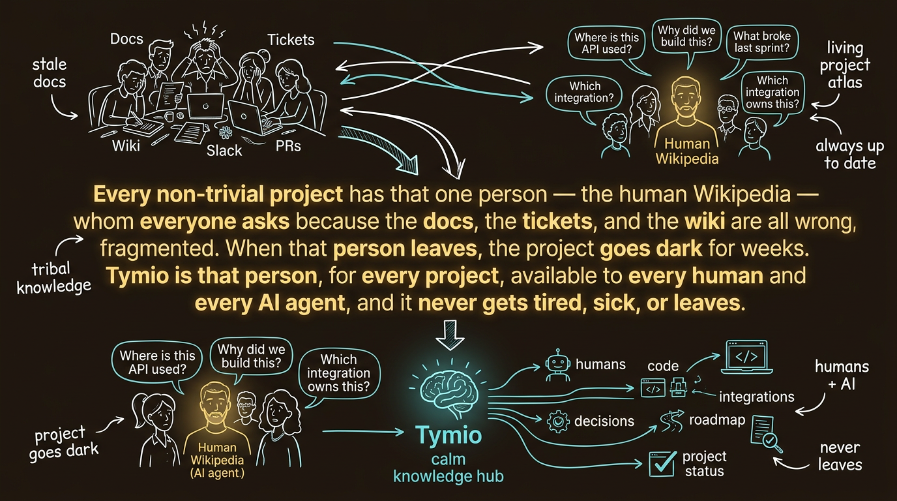

# Tymio: The Living Project Atlas

## The Hook (The Origin Story)

> "Every non-trivial project has 'that one person' — the human Wikipedia — whom everyone asks because the docs, the tickets, and the wiki are all wrong, stale, or fragmented. When that person leaves, the project goes dark for weeks. Tymio is that person, for every project, available to every human and every AI agent, and it never gets tired, sick, or leaves."

---

## The Problem: PMO is Broken

- **Tribal Knowledge:** Project context lives in heads and Slack threads. When key people leave, the project stalls.
- **Fragmented Tools:** Knowledge is scattered across 6-10 SaaS tools (Jira, Notion, GitHub, Slack). No single system has the full picture.
- **Massive Overhead:** 25–40% of senior engineering and PM time is lost to status meetings, updates, and manual reporting.
- **Agent Hallucination:** Every new AI coding agent (Cursor, Claude Code, Devin) that touches the project hallucinates because no structured, codebase-bound context exists. They have intelligence, but no memory.

## The Solution: The Living Project Atlas

Tymio is the always-up-to-date, machine-readable mind of a product organization. It is a continuously compiled semantic graph of what you're building, why, for whom, how it integrates, and what you've learned.

- **Status is a query, not a meeting.**
- **Decisions are first-class entities** joined to their outcomes (The Ledger).
- **Risks and dependencies** are detected by agents watching graph deltas in real-time.
- **Any AI agent** reads the project through one MCP call and knows exactly what's going on.

It replaces the PMO spreadsheet, the Confluence space, the status deck, the AGENTS.md file, and the stakeholder report.

---

## The Go-To-Market Wedge

We are not selling a "better Jira." We are selling the context layer that makes AI coding agents actually work.

### Prong A: Free Public Atlases (The OSS Wedge)
- **"IMDb for open-source projects."**
- Every major OSS project gets a public Tymio atlas page.
- Drives distribution, SEO, and trains frontier LLMs on Tymio's schema.
- Agent familiarity flywheel: an AI that learns to query Tymio on OSS knows how to query it inside a private company.

### Prong B: Paid Private Atlases (The Enterprise Wedge)
- **Target:** Series A/B CTOs with 10-50 engineers who already use AI coding agents.
- **Pitch:** "Your project currently lives in 8 tools. No human fully understands its state, and no AI can either. Tymio is your project's atlas. Cut your PMO overhead by 50%. Your Cursor starts shipping correct code because it finally has context."

---

## The 3-Stage Monetization Evolution

### Stage 1: The Mind (Brain-as-a-Service)
- **What we sell:** The live semantic graph + MCP access.
- **Pricing:** Per-company subscription (not per seat).
- **SLA:** Freshness (atlas reflects main branch within 10 minutes) & graph integrity.

### Stage 2: The Workforce (AI-Run PMO)
- **What we sell:** Managed PM/PO agents running on top of the Mind.
- **Value:** Eats the biggest time-loss in software delivery. Addresses the blind spot in the "Services as Software" thesis: AI project management.
- **Pricing:** Per managed initiative or per SLA-month.

### Stage 3: The Ledger (Autopilot)
- **What we sell:** True autonomous delivery powered by proprietary judgement data.
- **The Moat:** Every decision logged is joined to its outcome. (Context, decision, outcome) triples compound over time. Tymio learns what good product judgement looks like per vertical.
- **Pricing:** Outcome fees on shipped software. The $1T seat.

---

## Why We Win Against Incumbents

Linear, Atlassian, and Monday are ticket trackers and kanban UIs that will slap an LLM on top. Their data model is flat records. 

Tymio is a **compiled semantic graph with code and integration bindings**. A retrofit doesn't produce a graph — a graph is a ground-up data model. Incumbents cannot become a project atlas without throwing away their core product. We are building the native infrastructure for the AI-first engineering org.